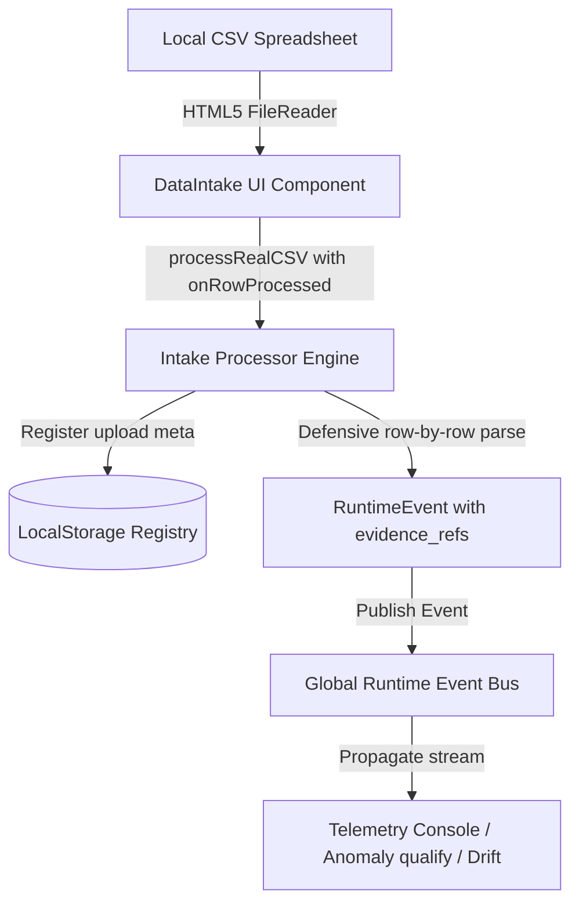

# NEXUS Ingestion Integration Phase Implementation

This document describes the design decisions, component updates, and verification results of the **Ingestion Integration Phase**.

---

## 1. Goal & Context
The goal of this phase is to transition the **NEXUS Command Center** from random, synthetically-generated mock operational telemetry loops into structured, real-world spreadsheet data ingestion. 

To maintain strict security and sandbox conditions, the ingestion is built to be **100% local-first and client-side safe**—requiring no cloud storage, no backend database writes, and no external AI interfaces.

---

## 2. Ingestion Pipeline & Architecture

The ingestion data stream flows strictly in local memory and utilizes local persistent registry metadata to track uploads:



### Key Subsystems:
1. **Local File Registry (`fileRegistry.ts`)**:
   - Manages an append-only JSON list of uploaded metadata in `localStorage` under the key `nexus::runtime::uploads`.
   - Generates an `upload_id` prefixed with `upl-${timestamp}`.
   - Enforces a **strict FIFO limit of the latest 20 uploads** to prevent disk bloat.
   - *Zero-Disclosure Rule*: Never caches raw, private spreadsheet contents; only indexing metadata (`filename`, `category`, `workspace`, `row_count`, `uploaded_at`).

2. **Spreadsheet Ingestion Processor (`intakeProcessor.ts` & `processRealCSV`)**:
   - Accepts incoming file name, content, category, and workspace, plus an optional progress callback `onRowProcessed`.
   - Normalizes headers to lower-case.
   - Bypasses empty spacer lines and malformed columns without halting execution.
   - Dynamically attempts to cast columns into safe primitives:
     - Casts numbers securely if they are numeric.
     - Casts `"true"` or `"false"` to standard booleans.
     - Sets blank spaces to `undefined` for downstream schema-safe fallbacks.
   - Maps CSV categories into explicit global event namespaces:
     - `attendance` $\rightarrow$ `omega.attendance.uploaded`
     - `fleet` $\rightarrow$ `fleet.refuel.logged`
     - `supplier` $\rightarrow$ `supplier.invoice.created`
     - `recruitment` $\rightarrow$ `recruitment.cv.detected`
     - `housing` $\rightarrow$ `housing.issue.reported`
     - Any unknown column categories standardise to `nexus.intake.unknown_row`.

3. **Interactive Telemetry UI (`DataIntake.tsx`)**:
   - Adds sleek cyber dropdown options for **Category** and **Target Workspace** inside the existing manual card.
   - Implements a hidden file input triggerable via a custom-styled `<label>` tag labeled **SELECT & INGEST CSV**.
   - Integrates HTML5 `FileReader` to read files securely on the client.
   - Implements a stream log mechanism that feeds individual parsed rows line-by-line into the **INGESTION TELEMETRY** terminal log window.
   - **Performance UI Cap**: Restricts individual row-by-row logs to a **maximum of 30 items** to protect React rendering limits during telemetry storm floods.
   - Emits a final consolidated log block with total counts parsed, successfully published, and malformed rows skipped.

---

## 3. Evidence Traceability Link

Each generated `RuntimeEvent` must guarantee forensic audit tracing. Every row-event contains an `evidence_refs` list pointing back to the physical source:

```typescript
evidence_refs: [
  "upload_id: upl-1716801901234",
  "row_number: 42",
  "original_source: driver_schedule_may26.csv"
]
```

No signal, anomaly, or Suppressed alarm qualifies downstream from a CSV source without this evidence reference list, securing total audit visibility.

---

## 4. Modified Files

| Path | Summary of Changes |
| :--- | :--- |
| **`src/runtime/events/intakeProcessor.ts`** | Extended `processRealCSV` signature with an optional `onRowProcessed` telemetry callback. Wired row iteration checks and event bus publishing loops to trigger this callback with appropriate parameters (`SUCCESS` vs `SKIPPED`). |
| **`src/pages/DataIntake.tsx`** | Added state variables for CSV Category, Workspace, and unique file input key. Integrated local HTML5 `FileReader` pipeline. Embedded category and workspace selectors and a custom file picker inside the excel-type card. Rendered streaming updates and the final summary directly to the logging console. |

---

## 5. Verification Results

### Build Execution
Vite build succeeds with zero compiler exceptions:
- **Command**: `pnpm -C apps/command-center-ui run build`
- **Result**: **SUCCESSFUL**

---

## 6. Operational & Security Assessment

### Handled Risks:
1. **Thread Blasting Protection**:
   - The UI limits individual row streaming prints to the first 30 rows. An index warning lets operators know subsequent rows were safely processed in the background but omitted from logs.
2. **Crash Resilience**:
   - Both the string splitter and column caster are wrapped inside strict `try/catch` and boundary null coalescing filters. Corrupt entries are tracked as `SKIPPED` rather than causing critical script exceptions.
3. **Data Sanitization**:
   - Zero-disclosure rules are respected. All data flows entirely in volatile stack memory. Only metadata indexes exist in `localStorage`.

---
*NEXUS Runtime Intelligence Platform — Hardened Operations Intake Module*
