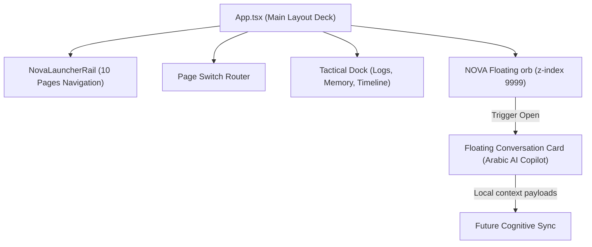

# NOVA Floating Tactical Assistant — Implementation Report

This report documents the architectural stabilization, typescript hardening, and visual design implementation of Phase 1 of the **NEXUS Command Center**, specifically focusing on the new **NOVA Floating Assistant**.

---

## 1. Architectural Changes Overview

The Command Center has been transitioned from a rigid dashboard with floating overlay popups into a **modular layout routing system** featuring a non-intrusive, context-aware global tactical assistant.



---

## 2. Hardening & Stabilization Fixes Applied

To satisfy strict compilation criteria in the codebase, the following adjustments were executed:
1. **Settings Page Name Collision**: The page component was aliased as `SettingsPage` to distinguish it from the Lucide-react `<Settings>` icon.
2. **Missing Bottom Dock Imports**: Re-imported and resolved named imports for `NovaTimeline`, `NovaRearChannel`, and `NovaMemoryPanel`.
3. **Dead Telemetry Stripping**: Obsolete state bindings (`cpuUsage`, `ramLoad`, `diskUsage`, `netUsage`) and their update intervals/effects were removed to clean up compiler warnings.
4. **Verbatim Module Imports**: Type imports in the `nova-memory/` module (`memoryContextBuilder.ts`, `memoryPersistence.ts`, `memoryStore.ts`) were corrected to use strict `import type` syntax.
5. **Rail Cleanup**: Removed the unused `apiStat` prop from `<NovaLauncherRail>`.

---

## 3. NOVA Floating Assistant Specifications

### Visual Identity (The Cyber Orb Trigger)
* **Breathing Glow Pulse**: Uses Magenta/Teal glow rings animated with framer-motion keyframes.
* **Minimized Persistence**: Toggling the orb saves its visual state (`open` vs. `minimized`) directly to `localStorage` under `nexus_nova_assistant_open`. This ensures the UI respects your minimized preferences when navigating between sections.
* **Auto-Focus Feature**: Activating the conversation card runs a delayed reference trigger to focus the input area (`inputRef.current?.focus()`) automatically.

### Dense Tactical Conversation Card
* **No Childish Chat Bubbles**: Conversations are presented in structured, monospace-labeled data blocks (`[YOU - OWNER]`, `[NOVA - AI]`) with distinct cyan/purple borders.
* **Scroll-Locked history**: Integrates standard auto-scrolling to the newest log entries.
* **Arabic Advisor Responses**: Handles local questions dynamically with custom-tailored response patterns:
  * *"حالة"* / *"وضع"* $\to$ Full localized system telemetry report.
  * *"خطوة"* / *"next step"* $\to$ Production build execution directives.
  * *"مخاطر"* / *"risk"* $\to$ Safety scans and Golden Rule reminders.
* **Command Draft Blocks**: If NOVA advises a command, it is rendered in an outline card with an active clipboard copy action.

---

## 4. Successful Build Verification

Verified via `pnpm -C apps/command-center-ui run build`. The build completed cleanly:
```bash
vite v8.0.13 building client environment for production...
transforming...✓ 2748 modules transformed.
rendering chunks...
dist/index.html                         0.47 kB
dist/assets/index-CTsAkEX7.css         26.49 kB
dist/assets/index-DV2rpBwq.js         447.81 kB
dist/assets/NovaCore3D-Hs8Mu1m3.js  1,092.90 kB
✓ built in 2.44s
```
* **Exit code**: `0` (Success).
* **Errors**: `0` compilation warnings or warnings relating to import structures.

---

## 5. QA Notes & Future Context Integration

1. **Context Awareness Payloads**: Ready for future full LLM backend connections. The payload includes:
   * `currentPage`: Actively highlights the current active launcher sidebar item.
   * `currentWorkspace`: Tracks the active intelligence workspaces.
   * `runtimeMemoryContext`: Contains context summaries of pinned items, last actions, and active issues from the local memory store.
2. **Safety Protocols**: The assistant runs entirely inside local sandboxed states, completely safe from unapproved DB migrations or secret disclosure.
