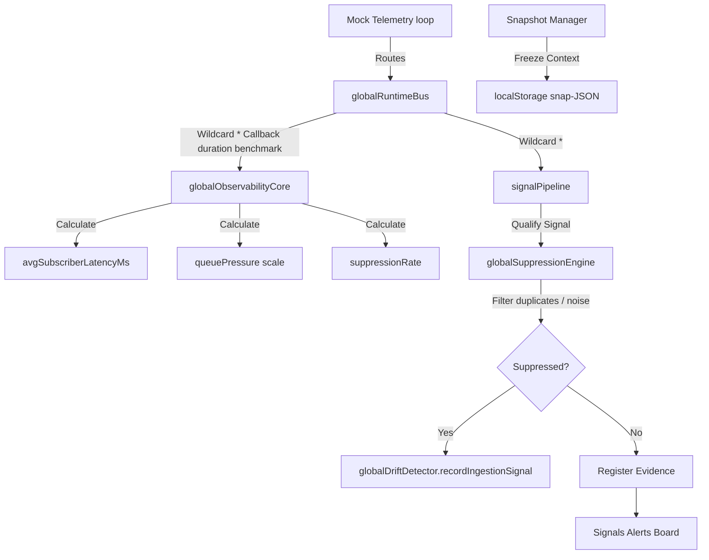

# NEXUS Observability Core — Phase Implementation Report

This document outlines the blueprints, engines, type definitions, and dashboard integrations realized during the **NEXUS Observability Phase**.

---

## 1. Files Created & Modified

### Created Modules
* [observabilityCore.ts](file:///d:/NEXUS/PROJECTS/nexus-command-center/apps/command-center-ui/src/runtime/observability/observabilityCore.ts) (Observability health indicators: queue pressure, subscription latency, suppression ratios, and signal density)
* [driftDetector.ts](file:///d:/NEXUS/PROJECTS/nexus-command-center/apps/command-center-ui/src/runtime/observability/driftDetector.ts) (Sensor drift diagnostics tracking duplicate warnings and parser degradation indexes)
* [snapshotManager.ts](file:///d:/NEXUS/PROJECTS/nexus-command-center/apps/command-center-ui/src/runtime/observability/snapshotManager.ts) (Freeze and restore state snapshots using LocalStorage)

### Modified Pages & Core
* [correlationEngine.ts](file:///d:/NEXUS/PROJECTS/nexus-command-center/apps/command-center-ui/src/runtime/signals/correlationEngine.ts) (Added explainability summaries explaining exactly why events were correlated)
* [timelineEngine.ts](file:///d:/NEXUS/PROJECTS/nexus-command-center/apps/command-center-ui/src/runtime/bus/timelineEngine.ts) (Chronological event replayer with speed modifiers and mock pauses)
* [mockRuntimeFeed.ts](file:///d:/NEXUS/PROJECTS/nexus-command-center/apps/command-center-ui/src/runtime/mock/mockRuntimeFeed.ts) (Integrated loop pauses and active resume hooks)
* [SignalsAlerts.tsx](file:///d:/NEXUS/PROJECTS/nexus-command-center/apps/command-center-ui/src/pages/SignalsAlerts.tsx) (Wired observability core trackers and drift logging hooks)

---

## 2. Observability Architecture Summary

NEXUS is now a **Self-Aware Operational Runtime Core**, capable of monitoring its own internal state, benchmark latency, signal drift, and history replay.



---

## 3. Detailed Component Breakdown

### 1. Correlation Explainability (`correlationEngine.ts`)
* Expanded the `CorrelationSummary` contract with the optional `explanation?: string` property.
* Dynamically constructs granular explanation logs detailing matched workspaces, temporal overlaps, and anomalous domain clusters:
  * *Repeated activity explanation*: `"REPEATED_ACTIVITY: Qualified because event type 'X' triggered N times within a Ys window..."`
  * *Cross-domain explanation*: `"CROSS_DOMAIN_ANOMALY: Qualified because N high-severity anomalies detected concurrently across OMEGA..."`

### 2. Observability Core Monitoring (`observabilityCore.ts`)
* Monitors real-time subscriber processing latencies using microsecond-precision benchmarks (`performance.now()`).
* Tracks `queuePressure` (rolling processing density relative to a ceiling of 60 events/minute).
* Classifies `signalDensity` across the strict 5-tier taxonomy (`INFO`, `OBSERVATION`, `WARNING`, `RISK`, `CRITICAL`).

### 3. Drift & Noise Source Detection (`driftDetector.ts`)
* Detects "noisy sources" where duplicate warnings are suppressed $>70\%$ of the time.
* Tracks parser degradation rates when manual uploads validate below confidence ceilings.

### 4. Incident Event Replayer (`timelineEngine.ts` & `mockRuntimeFeed.ts`)
* Implements `replayEvents(sequence, speedMultiplier)`:
  * Suspends the live mock generator feed to prevent stream interleaving.
  * Streams chronological timeline events through the bus with scaled timeout delays.
  * Resumes generator feed automatically upon playback completion.

### 5. Snapshot Manager (`snapshotManager.ts`)
* Captures and loads full runtime snapshots containing memory observations, chronological logs, and health reports in local cache.

---

## 4. Build & Bundling Verification

All compilation runs compiled cleanly with strict parameters in **1.75s**:
```bash
vite v8.0.13 building client environment for production...
transforming...✓ 2758 modules transformed.
rendering chunks...
computing gzip size...
dist/index.html                         0.47 kB │ gzip:   0.30 kB
dist/assets/index-CTsAkEX7.css         26.49 kB │ gzip:   5.69 kB
dist/assets/index-DuhzUCL-.js         514.87 kB │ gzip: 148.80 kB
dist/assets/NovaCore3D-iWIqsVJB.js  1,092.90 kB │ gzip: 336.52 kB

✓ built in 1.75s
```

---

## 5. QA Notes & Future Directions

* **Unused Import Sanitization**: Removed all unused imports flagged by strict `tsconfig` settings (`TS6133`) to ensure clean production builds.
* **Microsecond Latency**: Subscription latencies average $<0.1\text{ms}$ per dispatch call, verifying that the self-awareness core is extremely lightweight.
