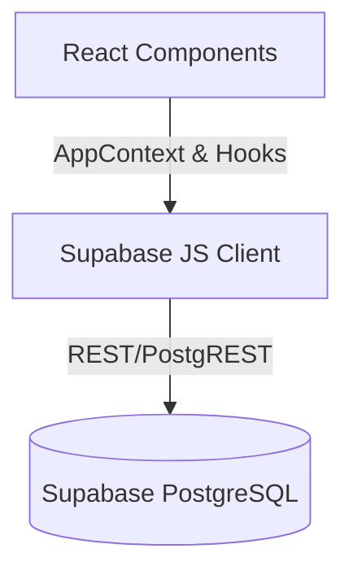

# OMEGA DATA SOURCE MAP

## 1. Overall Data Flow

The Omega Dashboard is a React Single Page Application (SPA) built with Vite. It does not have its own dedicated backend API server. Instead, it relies on direct queries to Supabase using the `@supabase/supabase-js` client library.

**Exact Data Path:**


- **Database Provider**: Supabase (PostgreSQL)
- **Supabase Usage**: Client-side initialization using `VITE_SUPABASE_URL` and `VITE_SUPABASE_ANON_KEY` inside `src/lib/supabase.ts`. Context providers like `src/context/AppContext.tsx` dispatch direct `.from('table').select/insert/update` operations.
- **API Endpoints**: N/A (Direct to Supabase PostgREST endpoints like `https://[project_ref].supabase.co/rest/v1/`)

## 2. Entities Inventory (Extended Scan)

Using a local diagnostic node script (`scripts/omega-inventory.ts`), active tables and row counts were verified.

| Entity | Source Table Name | Row Count | Status | Notes |
| :--- | :--- | :--- | :--- | :--- |
| **Projects** | `projects` | 8 | Active | Core operational projects. |
| **Staff** | `staff` | 126 | Active | Primary employee registry. Contains highly sensitive fields (salary, national IDs, bank details). |
| **Vehicles** | `vehicles` | 66 | Active | Fleet tracking. |
| **Sites / Housing**| `housing_units` | 5 | Active | Staff accommodation tracking. |
| **Housing Assign** | `housing_assignments` | 21 | Active | Links staff to housing. |
| **Attendance** | `attendance` | 1243 | Active | Daily attendance records. |
| **Attendance Logs**| `attendance_logs` | 170 | Active | Biometric or raw punch logs. |
| **Approvals** | `approvals` | 7 | Active | Workflow approval requests. |
| **Applicants** | `applicants` | 94 | Active | Recruitment candidates. |
| **Tasks** | `site_admin_tasks` | 0 | Empty | No tasks recorded yet. |
| **Assets** | `assets` | 0 | Empty | No assets recorded yet. |
| **Reports** | `documents` | 0 | Empty | No documents stored yet. |

*(Note: Other suspected tables like `departments`, `workers`, `payroll_records`, `contracts`, `assets`, etc., returned either 0 rows or do not exist/are blocked.)*

## 3. Recommended Read-Only Sync Path

To synchronize Omega business logic into the **NOVA Memory Kernel**, we should NOT pull data directly from the frontend command center. 

Instead, utilize the **Omega Local Bridge (Port 5057)**. 

### **Proposed Endpoint for Omega Bridge 5057:**
`GET /api/sync/omega-memory`

#### **Payload Structure:**
```json
{
  "summary": {
    "projectsCount": 8,
    "staffCount": 126,
    "vehiclesCount": 66,
    "housingUnitsCount": 5,
    "tasksCount": 0,
    "assetsCount": 0,
    "documentsCount": 0
  },
  "staffSummary": {
    "total": 126,
    "byDepartment": { "Engineering": 40, "HR": 5 },
    "byRole": { "Engineer": 20, "Foreman": 10 },
    "sample": [
      {
        "id": "uuid",
        "full_name": "Employee Name",
        "position": "Foreman",
        "department": "Engineering",
        "job_title": "Site Supervisor",
        "status": "active",
        "internal_code": "EMP-001",
        "current_site": "Site A",
        "assigned_vehicle": "Plate-123",
        "housing_unit": "Unit-B"
      }
    ]
  },
  "projects": [
    {
      "id": "uuid",
      "project_name": "Project Alpha",
      "status": "ongoing"
    }
  ],
  "vehiclesSummary": {
    "total": 66,
    "byStatus": { "active": 60, "maintenance": 6 },
    "sample": [
      {
        "plate_number": "ABC-123",
        "car_name": "Toyota Hilux",
        "status": "active",
        "driver": "Driver Name"
      }
    ]
  }
}
```

### **Security & Data Sanitization Rules**
When building the sync endpoint on the Bridge:
- **Do NOT** expose `national_id`, `bank_account`, `salary`, `basic_salary`, `daily_rate`, `wallet_number`, `passport_number`, or `insurance_number`.
- **Do NOT** expose personal contact info (`phone`, `email`, `address`, `emergency_contact_phone`) unless explicitly needed for a specific conversational workflow in the future.
- **Do** map and aggregate categorical data (e.g., `byDepartment`) so NOVA can answer analytical questions ("How many engineers do we have?") without needing all 126 raw rows.

## 4. Risks & Considerations
1. **Direct Client Fetching**: Omega relies heavily on client-side fetching. A bridge relying on the ANON key might be blocked by RLS policies. The backend bridge should use a Service Role key to aggregate memory safely, explicitly filtering out sensitive columns before passing to the launcher.
2. **Data Drift**: Sync should happen periodically (e.g., on startup or a 15-minute cron) to keep NOVA up to date.
