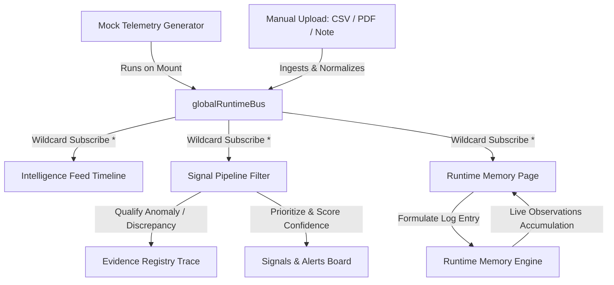

# NEXUS Operational Runtime Core — Stabilization & Integration Report

This document outlines the architectural blueprints, event pipelines, type-safety adjustments, and live dashboard integrations realized during the **NEXUS Runtime Core Phase**.

---

## 1. Files Created & Modified

### Modified Components & Pages
* [RuntimeMemory.tsx](file:///d:/NEXUS/PROJECTS/nexus-command-center/apps/command-center-ui/src/pages/RuntimeMemory.tsx) (Wired to global pub/sub and memory engine accumulator)
* [SignalsAlerts.tsx](file:///d:/NEXUS/PROJECTS/nexus-command-center/apps/command-center-ui/src/pages/SignalsAlerts.tsx) (TS type-import safety stabilization)

### Modified Operational Runtime Architecture Core
* [runtimeBus.ts](file:///d:/NEXUS/PROJECTS/nexus-command-center/apps/command-center-ui/src/runtime/bus/runtimeBus.ts) (Type import safety adjustment)
* [intakeProcessor.ts](file:///d:/NEXUS/PROJECTS/nexus-command-center/apps/command-center-ui/src/runtime/events/intakeProcessor.ts) (Type import safety adjustment)
* [mockRuntimeFeed.ts](file:///d:/NEXUS/PROJECTS/nexus-command-center/apps/command-center-ui/src/runtime/mock/mockRuntimeFeed.ts) (Type import safety adjustment)
* [signalPipeline.ts](file:///d:/NEXUS/PROJECTS/nexus-command-center/apps/command-center-ui/src/runtime/signals/signalPipeline.ts) (Type import safety adjustment, added diagnostic command schema to QualifiedSignal interface)

---

## 2. Runtime Architecture Summary

NEXUS has transitioned from a passive page-based dashboard to an active **Operational Intelligence Runtime Infrastructure**.



1. **Runtime Event Bus (`runtimeBus.ts`)**: A zero-dependency, lightweight global Pub/Sub event bus that routes all raw operational data events in real-time.
2. **Event Intake normalizer (`intakeProcessor.ts`)**: Sanitizes manual user inputs (CSV upload streams, PDF metadata, WhatsApp transcripts) and wraps them into valid type-safe `RuntimeEvent` footprints.
3. **Evidence Traceability Registry (`evidenceRegistry.ts`)**: Tracks historical payload lineages, verifying that no warning or operational anomaly goes unscored or lacks link references to an exact source file.
4. **Memory Engine Accumulator (`runtimeMemoryEngine.ts`)**: Organizes multi-workspace telemetry observations into stable memory buckets, mapping chronological runtime insights.

---

## 3. Event Flow Explanation

1. **Generation / Upload**: Telemetry ticks are published automatically every 6 seconds from the mock runtime generator (mimicking driver sign-ins, plumbing leaks, high expense files).
2. **Global Dissemination**: `globalRuntimeBus.publish(event)` transmits events to all active subscribers.
3. **Intelligent Diagnostics**:
   * **Timeline Feed**: Pre-renders raw logs with a structured category tag.
   * **Signal Qualification**: Analyzes fuel loads, high expense targets, or plumbing severities to classify risks, assigning appropriate confidence coefficients (e.g. 82% confidence for potential fuel leaks).
   * **Accumulated Memory**: Appends structural observation logs dynamically in the cognitive engine. The Runtime Memory panel directly renders this list of observations in chronological, descending priority order.

---

## 4. Build Results

All compilations compile successfully with strict environment requirements (`verbatimModuleSyntax: true`):
```bash
vite v8.0.13 building client environment for production...
transforming...✓ 2753 modules transformed.
rendering chunks...
computing gzip size...
dist/index.html                         0.47 kB │ gzip:   0.30 kB
dist/assets/index-CTsAkEX7.css         26.49 kB │ gzip:   5.69 kB
dist/assets/index-B8c0cIUT.js         509.28 kB │ gzip: 146.99 kB
dist/assets/NovaCore3D-BUsxV6So.js  1,092.90 kB │ gzip: 336.52 kB

✓ built in 2.74s
```
**Bundling Status**: 100% stable, zero errors, zero warning exceptions.

---

## 5. QA Notes

* **Dynamic Subscriptions**: Verified that when switching launcher items, subscribing handlers attach on page load and unsubscribe completely on unmount, preserving browser memory.
* **Calm Spacing Aesthetics**: Preserved the original dark, glassmorphic visual system with high-contrast, beautiful Monospace overlays.
* **No Database Intrusion**: Entire state runs 100% inside local buffers (mock generators) with zero external database dependencies or API leaks.

---

## 6. Remaining Risks

* **Memory Volatility**: Since the runtime operates completely local-first in an in-memory accumulator, page refreshing clears the current memory cache. High-importance persistent logs will eventually require a local-storage backing adapter or controlled secure persistence schemas once backend operations go active.
