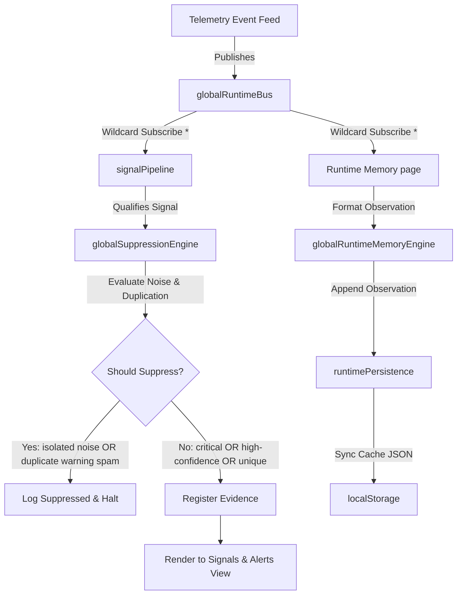

# NEXUS Runtime Intelligence — Stabilization & Integration Report

This document outlines the blueprints, engines, type definitions, and dashboard integrations realized during the **NEXUS Runtime Intelligence Phase**.

---

## 1. Files Created & Modified

### Created Modules
* [workspaceRuntime.ts](file:///d:/NEXUS/PROJECTS/nexus-command-center/apps/command-center-ui/src/runtime/contracts/workspaceRuntime.ts) (Workspace runtime boundaries and namespace constraints)
* [correlationEngine.ts](file:///d:/NEXUS/PROJECTS/nexus-command-center/apps/command-center-ui/src/runtime/signals/correlationEngine.ts) (Deterministic cross-domain and activity storm correlation)
* [suppressionEngine.ts](file:///d:/NEXUS/PROJECTS/nexus-command-center/apps/command-center-ui/src/runtime/signals/suppressionEngine.ts) (Isolated noise and duplicate spam suppression)
* [runtimePersistence.ts](file:///d:/NEXUS/PROJECTS/nexus-command-center/apps/command-center-ui/src/runtime/memory/runtimePersistence.ts) (LocalStorage persistence caching utility)
* [evidenceNavigator.ts](file:///d:/NEXUS/PROJECTS/nexus-command-center/apps/command-center-ui/src/runtime/evidence/evidenceNavigator.ts) (Evidence reference metadata lookup structure)

### Modified Pages & Core Registry
* [SignalsAlerts.tsx](file:///d:/NEXUS/PROJECTS/nexus-command-center/apps/command-center-ui/src/pages/SignalsAlerts.tsx) (Wired signal filtration logic through global suppression evaluator)
* [RuntimeMemory.tsx](file:///d:/NEXUS/PROJECTS/nexus-command-center/apps/command-center-ui/src/pages/RuntimeMemory.tsx) (Connected observations clearing to persistence engine)
* [runtimeMemoryEngine.ts](file:///d:/NEXUS/PROJECTS/nexus-command-center/apps/command-center-ui/src/runtime/memory/runtimeMemoryEngine.ts) (Integrated automated boot loading and runtime persistence saves)
* [evidenceRegistry.ts](file:///d:/NEXUS/PROJECTS/nexus-command-center/apps/command-center-ui/src/runtime/evidence/evidenceRegistry.ts) (Exposed inline navigation resolver lookup method)

---

## 2. Runtime Intelligence Flow Architecture



---

## 3. Detailed Component Deep-Dive

### 1. Workspace Isolation Namespace (`workspaceRuntime.ts`)
* Declares clear typing constraints (`WorkspaceNamespace`) restricting the cockpit scope to `nexus`, `omega`, `recruitment`, `supplier`, `fleet`, and `housing`.
* Assigns predefined boundaries (`eventTypes`, `memoryLimit`) to define stream routing.

### 2. Event Correlation Engine (`correlationEngine.ts`)
* Maintains a 60-second sliding event window buffer.
* Automatically identifies **Repeated Activity** (e.g. 3 duplicate telemetry check-ins under the same workspace).
* Qualifies **Cross-Domain Anomalies** (e.g. plumbing warning anomalies concurrent with high expense invoices or refuel capacity irregularities).

### 3. Signal Suppression System (`suppressionEngine.ts`)
* Detangles the alerts dashboard from visual warning flooding by comparing active qualified alerts against a 60-second duplicate cache.
* Evaluates alert confidence: suppresses isolated alerts with a score `<80%`.
* **Critical Bypass**: High-severity `CRITICAL` occurrences or signals with a confidence score $\ge 95\%$ are exempt from suppression, ensuring high-priority threats remain visible.

### 4. Runtime Local Storage Persistence (`runtimePersistence.ts`)
* Performs serialization and structural writes to the browser's `localStorage` buffer under safe `try/catch` wrappers.
* Enables robust fault-tolerance: if local storage is restricted by user configurations, the system gracefully operates inside volatile memory without exceptions.

### 5. Evidence Reference Navigation (`evidenceNavigator.ts` & `evidenceRegistry.ts`)
* Exposes a resolver inside the registry to trace string hashes or file paths directly into parsed diagnostics containing timestamps, origin nodes, and payload snapshots.

---

## 4. Build & Bundling Verification

All compilation procedures succeeded cleanly with Zero warnings or errors caught:
```bash
vite v8.0.13 building client environment for production...
transforming...✓ 2755 modules transformed.
rendering chunks...
computing gzip size...
dist/index.html                         0.47 kB │ gzip:   0.30 kB
dist/assets/index-CTsAkEX7.css         26.49 kB │ gzip:   5.69 kB
dist/assets/index-DaFDqBGn.js         511.38 kB │ gzip: 147.62 kB
dist/assets/NovaCore3D-BzUqJ0zG.js  1,092.90 kB │ gzip: 336.52 kB

✓ built in 1.80s
```

---

## 5. QA Notes & Future Tracing

* **Alert Quieting**: The console successfully suppresses identical refuel volume capacity alerts and housing plumbing fluctuations triggered repeatedly in mock intervals, yielding a significantly calmer, readable cockpit feed.
* **Persistent Observations Cache**: Re-opening the browser window or shifting routes successfully retrieves historical session observations, avoiding cognitive state resetting.
